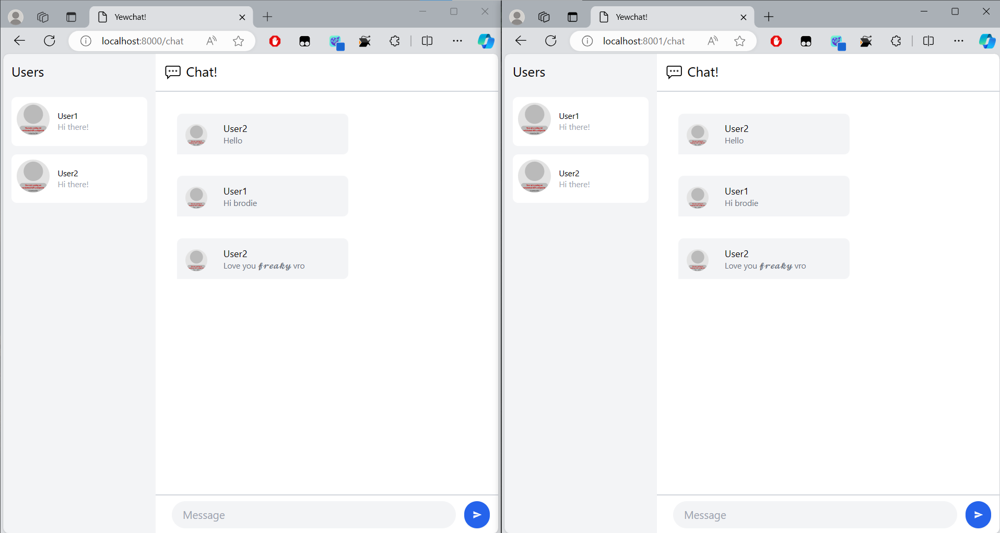
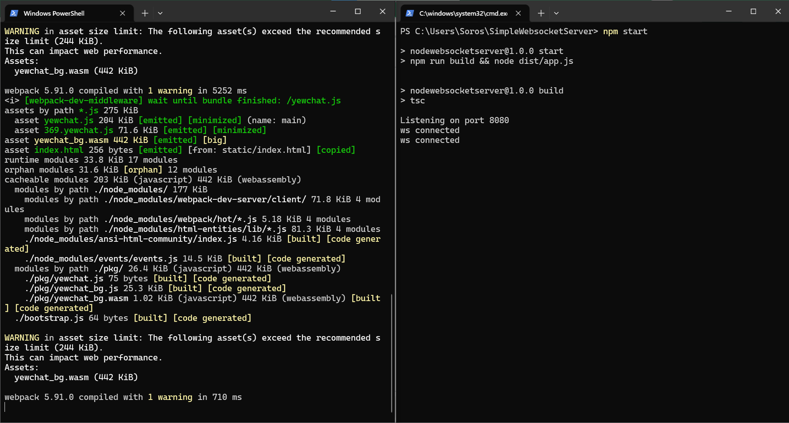
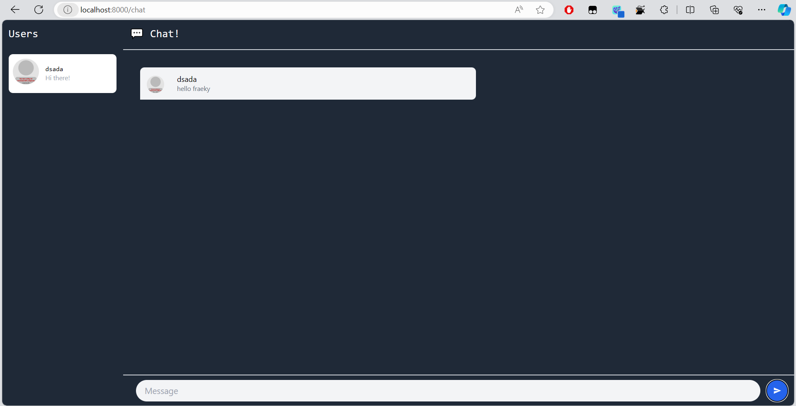

# Module 10: Asynchronous Programming
> **Soros Febriano** || **2206083445**

## Experiment 3.1: Original code

## Experiment 3.2: Be Creative!

I changed the chat into dark mode and changed the fonts into sans-mono